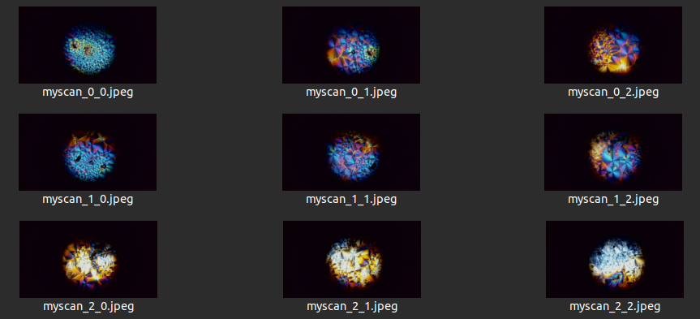

# webcam_mosaic

Scanning slides with a microscope, a 3D printer and a webcam

```bash
python3 mosaic.py \
  --serial_port /dev/ttyUSB0 \
  --camera_device /dev/video4 \
  --prefix "capture/myscan" \
  --x_step 1.5 \
  --y_step 1.5 \
  --n_x 3 \
  --n_y 3 \
  --settle_time 300
```

Result: 
